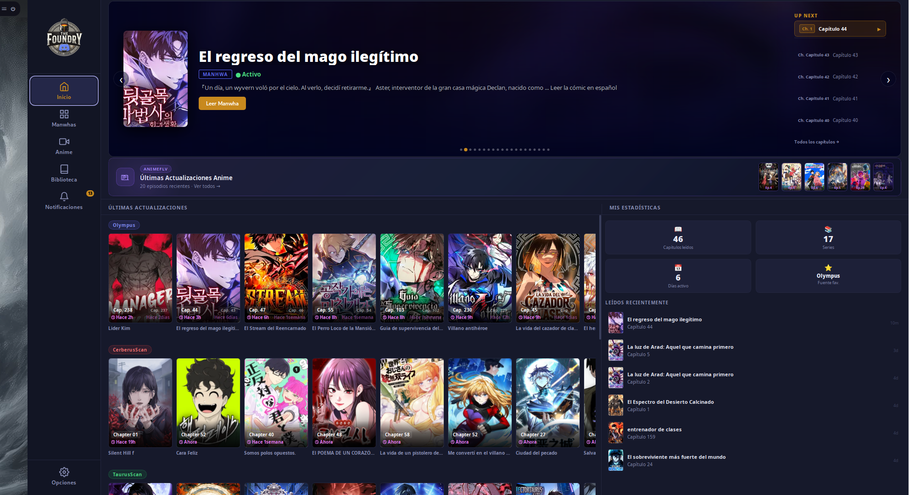
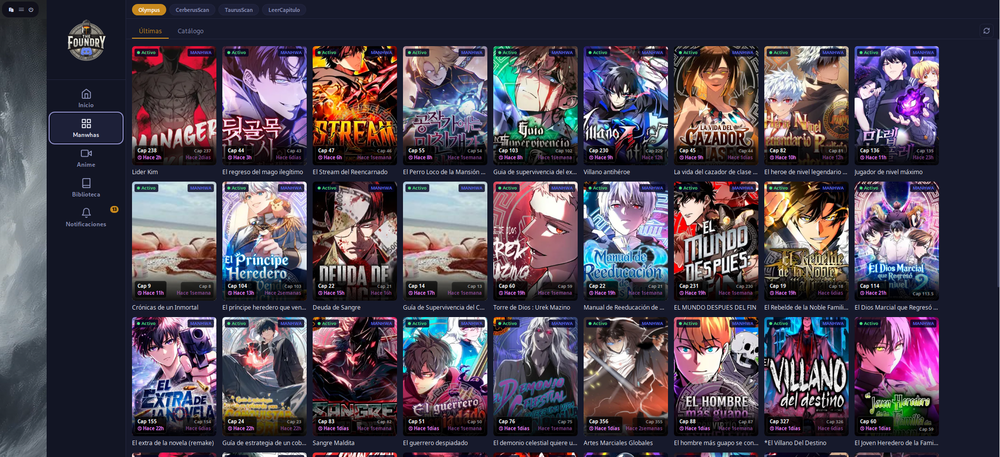
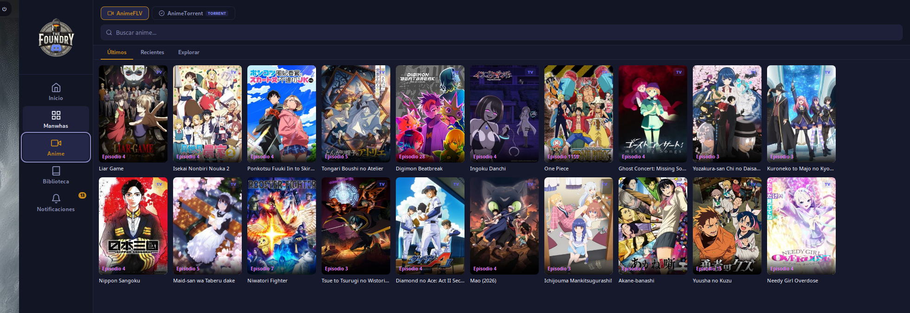
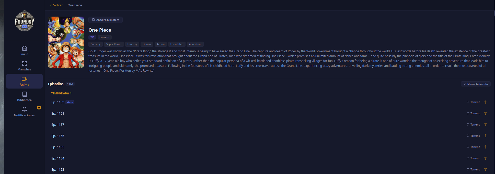
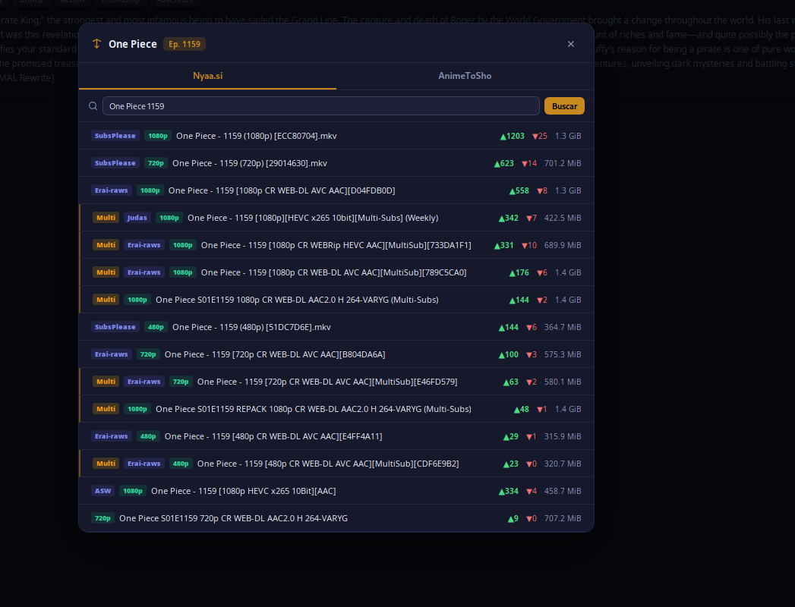
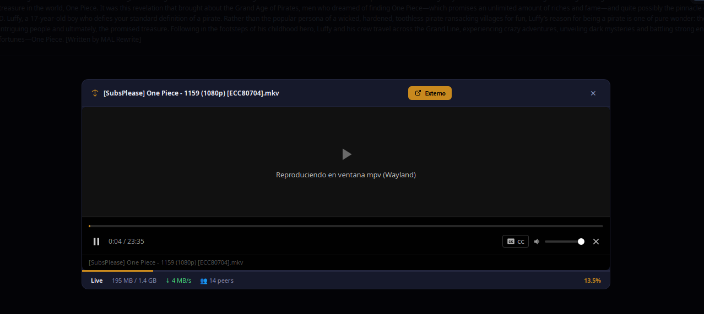

# TheFoundry App

Aplicación de escritorio para leer manga y ver anime, construida con **Tauri v2** (Rust + Svelte). Agrega varias fuentes de scanlation en español en una sola interfaz oscura con biblioteca personal, notificaciones de nuevos capítulos, streaming de anime vía torrent y reproductor MPV integrado.



---

## Características

- **Manga** — Últimas actualizaciones y catálogo completo de OlympusScans, CerberusScan, TaurusScan y LeerCapítulo.
- **Anime** — Episodios recientes vía AnimeFLV; búsqueda de torrents en Nyaa.si y AnimeToSho.
- **Streaming de anime** — Descarga progresiva con librqbit; empieza a reproducir antes de que termine la descarga.
- **Reproductor MPV integrado** — Wayland y X11, con subtítulos, control de volumen y seek.
- **Biblioteca personal** — Marca series como favoritas, registra capítulos/episodios leídos/vistos.
- **Notificaciones de escritorio** — Alerta cuando hay nuevos capítulos de tus series guardadas.
- **Bandeja del sistema** — La app se minimiza a la bandeja; autoarranque opcional al iniciar sesión.

---

## Capturas

| | |
|---|---|
|  |  |
| Catálogo de manwhas | Sección de anime |
|  |  |
| Detalle de serie con episodios | Búsqueda de torrents (Nyaa.si / AnimeToSho) |


*Reproductor MPV con streaming en vivo — 13 % descargado, reproduciendo*

---

## Instalación en Linux

El script `install-linux.sh` instala dependencias del sistema, compila la app desde el código fuente y crea la entrada en el menú de aplicaciones.

```bash
git clone https://github.com/madkyp/manga-reader.git
cd manga-reader
chmod +x install-linux.sh
./install-linux.sh
```

Para desinstalar:

```bash
./install-linux.sh --uninstall
```

### Actualizar

El script `update-linux.sh` trae los últimos cambios de Git, recompila la app **solo si hay novedades** y reinstala el binario, los iconos y la entrada de menú. No reinstala las dependencias del sistema.

```bash
./update-linux.sh           # actualiza a la última versión
./update-linux.sh --check   # solo comprueba si hay actualizaciones (no compila)
./update-linux.sh --force   # reinstala aunque ya estés al día
```

> Si la app estaba abierta, ciérrala y vuelve a abrirla para aplicar la actualización.

### Distros soportadas

| Distro | Gestor |
|--------|--------|
| Arch / CachyOS / Manjaro / EndeavourOS | pacman |
| Debian / Ubuntu / Mint / Pop!\_OS | apt |
| Fedora / RHEL | dnf |
| openSUSE | zypper |

### Dependencias del sistema

El script las instala automáticamente. En otras distros instálalas manualmente:

| Paquete | Para qué |
|---------|----------|
| `webkit2gtk-4.1` | WebView de Tauri |
| `gtk3` | Ventana y tray |
| `libayatana-appindicator` | Icono en bandeja |
| `librsvg` | Iconos SVG |
| `openssl` | Peticiones HTTPS |
| `nodejs` ≥ 18, `npm` | Compilar frontend Svelte |
| `ffmpeg` | Transmuxing de vídeo |
| `mpv` | Reproductor embebido |
| `base-devel` / `build-essential` | Compilación Rust |

### Dependencias de compilación

- **Rust** ≥ 1.77.2 — el script lo instala con `rustup` si no está presente.
- **Node.js** ≥ 18 — incluido en los paquetes del sistema.

> La primera compilación puede tardar **10–20 minutos** dependiendo del hardware (descarga y compila el runtime de Rust + dependencias de Tauri).

---

## Stack técnico

| Capa | Tecnología |
|------|-----------|
| Frontend | Svelte 5 + Vite |
| Backend | Rust (Tauri v2) |
| HTTP / scraping | reqwest (blocking + async), regex |
| Torrents | librqbit 8 |
| Vídeo | mpv (proceso externo con IPC) |
| Notificaciones | tauri-plugin-notification |
| Autostart | tauri-plugin-autostart |

---

## Fuentes de contenido

- **Manga**: [OlympusScans](https://olympusbiblioteca.com), [CerberusScan](https://cerberusscans.com), [TaurusScan](https://tauruscan.com), [LeerCapítulo](https://leercapitulo.com)
- **Anime**: [AnimeFLV](https://animeflv.net), [Kitsu](https://kitsu.io)
- **Torrents**: [Nyaa.si](https://nyaa.si), [AnimeToSho](https://animetosho.org)

---

## Licencia

Uso personal. Los contenidos son propiedad de sus respectivos autores y scanlators.
